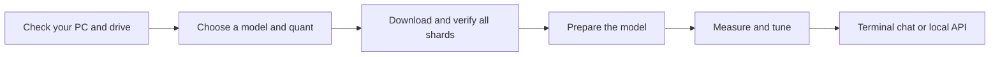

# How Strata Unleashed works

The large model is a mixture of experts: each generated token uses only some of its expert weights. Strata spreads the work across the GPU, CPU, RAM and SSD instead of requiring the whole model in VRAM.

The inference engine comes from [Strata](https://github.com/Niko1221/Strata). Unleashed adds a model picker/downloader, broader quantization paths, optional-MTP operation, mixed cache formats and a procedural tuner.

## From download to chat

The catalog records pinned revisions, sizes, hashes and header checks. A download is complete only after its SHA256 matches. Model files are retained in their original format; a local pack prepares the small weights and tokenizer the engine needs.

## What each part does

- **GPU:** dense work, attention/cache operations, and experts that fit in the GPU cache.
- **RAM and CPU:** resident expert weights and computation for uncached experts; some misses can instead transfer to the GPU.
- **SSD:** model storage and disk-backed PLE lookup rows. Faster sequential reads help loading, while inference also depends on access patterns and latency.

The guided workflow uses one NVIDIA GPU and resident experts. Upstream's other backends and low-RAM modes have separate constraints.

## How tuning chooses settings

First establish a measured VRAM budget: total memory minus automatic headroom and the user's extra reserve. Test cache formats, CPU workers, uncached-expert transfer share, draft settings when an MTP head exists, and prompt chunk sizes. Compare candidates against fresh control runs so changing machine conditions do not make an old fast result the permanent winner.

The first objective is generation speed on 512 input and 512 output tokens. The second is prompt processing on a longer input while retaining at least 90% of the generation baseline. Only a configuration that passes final checks is saved. This is a measured search over supported settings, not proof of a global optimum.

## Why test chat has no system prompt

Test chat passes user/assistant turns directly through the model's chat template with thinking instructions off. It rejects templates that still insert a system turn. There are no tool descriptions, agent instructions or default assistant persona in that path. The normal chat framing remains; it is not a raw text-completion interface.

[Engineering note and measurements](paper/Strata-Unleashed.md) · [Original upstream paper](paper/Strata-Paper.pdf) · [Engine reference](DETAILS.md)
